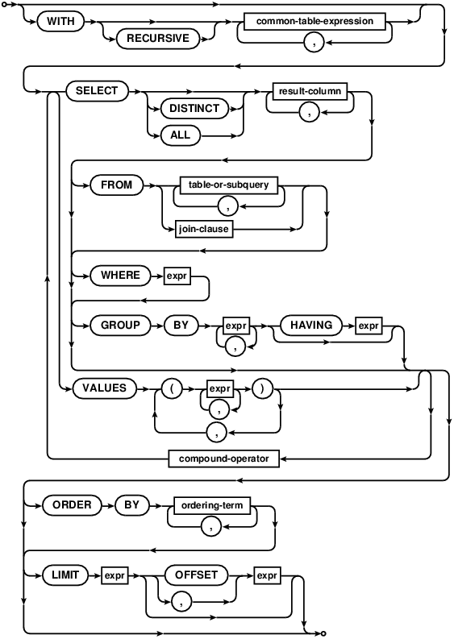

# USCOTS 2025 data technologies breakout

This is the `README.md` file for the public GitHub repo to accompany the breakout session led by Johanna Hardin and Nicholas Horton Horton at USCOTS 2025

LINK: https://github.com/nicholasjhorton/uscots2025-sql-data-technologies

- Nicholas J. Horton (Amherst College) and Johanna S. Hardin (Pomona College)
- B1B: "Leveraging data technologies to model bigger datasets"
- Friday, July 18th, 9:45 am – 11:00 am CT

The American Statistical Association's (ASA) Data Expo 2025 made more than 210 million flights from 1987-2024 accessible for analysis. This breakout session introduces participants to essential data technologies—SQL (structured query language), DuckDB, and Parquet files—through hands-on analysis of this airline delay data scaffolded using reproducible analysis tools (Quarto).

Designed for educators teaching introductory and intermediate statistics and data science courses, the session demonstrates how modern tools streamline data exploration, enable efficient data handling, and facilitate modeling while fostering engaging, real-world learning experiences for students. Participants will gain practical skills to simplify and scaffold processing large datasets using SQL and DuckDB for in-memory data analysis and modeling. The session also highlights the advantages of Parquet files for efficient data storage and retrieval.

Intended Audience: Educators in statistics or related fields, particularly those teaching introductory-level and intermediate-level courses, with an interest in incorporating modern data technologies into their curriculum.

Prerequisites: Prior experience using RStudio. Familiarity with RMarkdown or Quarto highly desirable. Recent (2024 or later) versions of RStudio and R and installation of the `tidyverse` and `duckdb` packages.

Goals:

1. Understand the fundamentals of Quarto, SQL, DuckDB, and Parquet file formats.
2. Apply these technologies to wrangle, analyze, and model large airline flight delay datasets.
3. Explore strategies to integrate these tools into teaching introductory statistics and data science courses.

## Instructions for attendees

1. Ensure that you have RStudio and R loaded on your laptop
2. Ensure that you have installed the `tidyverse` and `duckdb` packages
3. Download the activity files repo: https://github.com/nicholasjhorton/uscots2025-sql-data-technologies/archive/refs/heads/main.zip
4. Unzip the files
5. Open the `1_download_data.qmd` file in that folder within RStudio and click `Render`: this will download data from 2023 and 2024
6. Open the `2_explore_sql.qmd` file within RStudio and click `Render`: this will analyze the data you've downloaded. If this runs, congrats: you are accessing data using SQL on your computer.
7. Now you can start to add on your own analyses and explorations.

## Materials on this repo:

- Minilecture 1: https://github.com/nicholasjhorton/uscots2025-sql-data-technologies/blob/main/mini-lecture1.pdf
- Minilecture 2: https://github.com/nicholasjhorton/uscots2025-sql-data-technologies/blob/main/mini-lecture2.pdf
- Minilecture 3: https://github.com/nicholasjhorton/uscots2025-sql-data-technologies/blob/main/mini-lecture3.pdf
- Activity 1 (downloading a subset of the airlines data): https://github.com/nicholasjhorton/uscots2025-sql-data-technologies/blob/main/1_download_data.qmd
- Activity 2 (accessing the airlines data using SQL): https://github.com/nicholasjhorton/uscots2025-sql-data-technologies/blob/main/2_explore_sql.qmd
- Activity 3 (accessing the airlines data using dplyr): https://github.com/nicholasjhorton/uscots2025-sql-data-technologies/blob/main/3_explore_dplyr.qmd
- Setting up a SQL server: https://github.com/nicholasjhorton/uscots2025-sql-data-technologies/blob/main/sql-server-instructions.pdf

## Resources and useful links

- more information on the airlines flight data (Data Expo 2025): https://community.amstat.org/dataexpo/home 
- additional resources on accessing databases in R: https://beanumber.github.io/abdwr3e/12-large.html, https://mdsr-book.github.io/mdsr3e/15-sqlI.html, and https://mdsr-book.github.io/mdsr3e/16-sqlII.html
- Jo's overview of SQL and databases: https://hardin47.netlify.app/courses/sds261-sql
- Databases in the tidyverse: https://beanumber.github.io/tidy-databases
- Timing of CSV vs. parquet: https://posit.co/blog/speed-up-data-analytics-with-parquet-files
- Paul Roback course materials (top level): https://proback.github.io/264_fall_2024
- Paul Roback course materials (exercises): https://proback.github.io/264_fall_2024/16_SQL_exercises.html
- Public facing SQL database (auditory files): https://www.science.smith.edu/wai-database
- SQL server setup instructions: https://github.com/nicholasjhorton/uscots2025-sql-data-technologies/blob/main/sql-server-instructions.pdf, https://mdsr-book.github.io/mdsr3e/16-sqlII.html, and https://mdsr-book.github.io/mdsr3e/F-dbsetup.html

Last updated 2025-07-14

